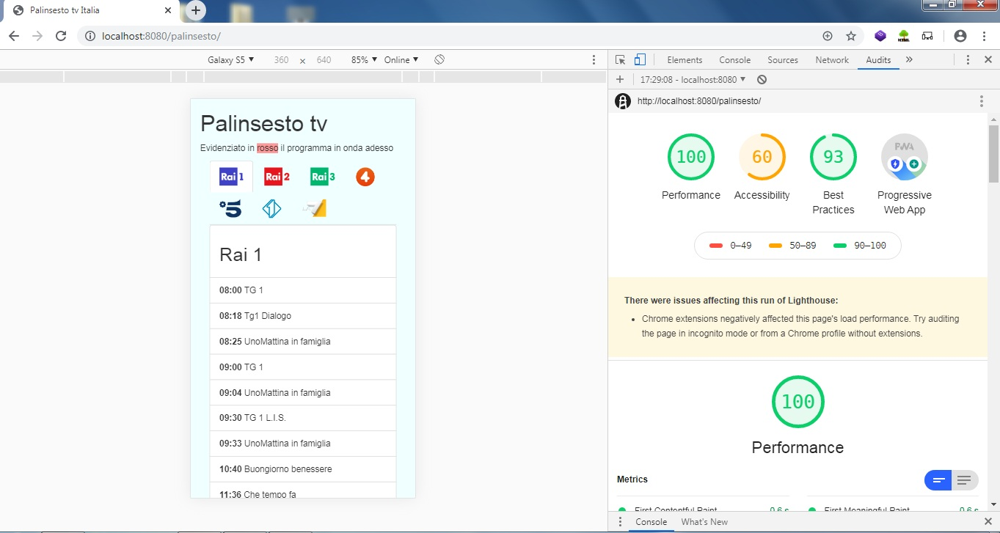
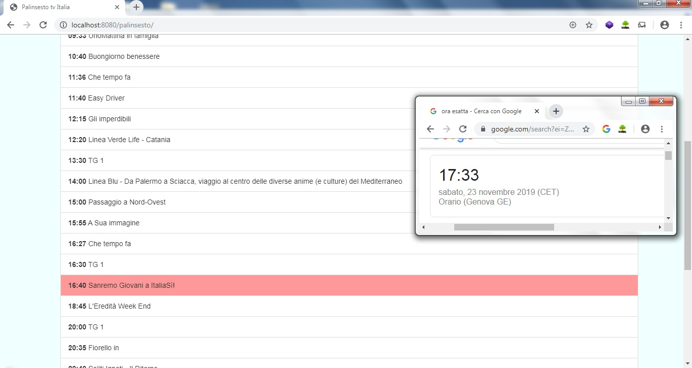

# PWA-televisionschedule
PWA for italian television schedule 

<h2> Introduction </h2>
<b>CREATED FOR DEMONSTRATION PURPOSES ONLY </b>

This progressive web application works thanks to web scraping information from https://hyle.appspot.com/.
For web scraping I used "simple html dom" https://simplehtmldom.sourceforge.io/ 

<h2> Description </h2>
The PWA is full responsive design.
Through this PWA is also possible to check the current program live now, the live program is highlighted in red.

<h2> Images </h2>

Screenshot 1 PWA Google audits 

Screenshot 2 live channel
